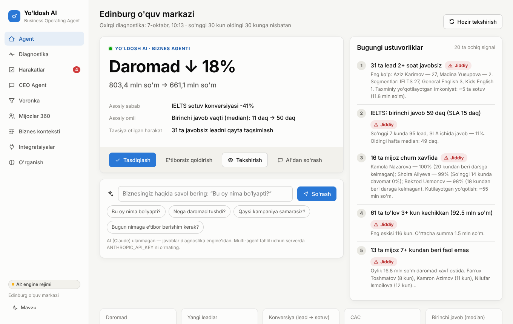
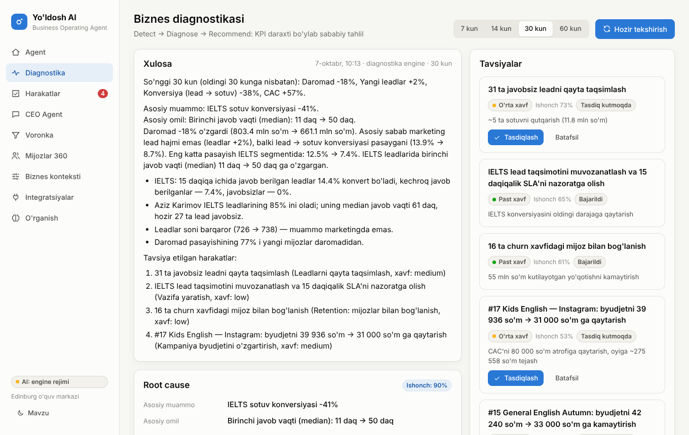

# Yo'ldosh AI — AI Business Operating Agent

**Yo'ldosh AI** biznesning mavjud tizimlaridagi (reklama kabinetlari, CRM, to'lov tizimlari, davomat, Excel/1C) ma'lumotlarni avtomatik yig'adi, yagona modelga birlashtiradi, muammolarni topadi, **sababini aniqlaydi**, qaror tavsiya qiladi va ruxsat berilgan bo'lsa **harakatni o'zi bajaradi** — keyin natijani o'lchab, o'rganadi.

```
Existing Business Data → AI Understanding → Decision → Action → Result → Learning
```

Bu oddiy CRM, BI dashboard yoki chatbot emas. Asosiy qiymat — **AI biznesni ko'radi → tushunadi → muammoni topadi → nima qilish kerakligini aniqlaydi → harakat qiladi → natijani o'lchaydi**. Xodimlardan qo'shimcha data-entry talab qilinmaydi.



---

## Nima qila oladi (MVP)

| Imkoniyat | Qisqacha |
|---|---|
| **Daily Business Diagnosis** | Har kuni ertalab biznesni tekshiradi: KPI'lar, root cause, ustuvorliklar, tavsiyalar (+ Telegram'ga yuboradi) |
| **Root cause tahlili** | Daromad o'zgarishini KPI daraxti bo'ylab parchalaydi: *Daromad → yangi mijozlar → sotuvlar → konversiya → IELTS → javob vaqti 11 → 50 daq* |
| **Multi-agent AI (Claude)** | CEO Agent savolga qarab Marketing, Sales, Finance, Customer, Operations agentlarini parallel ishga tushiradi |
| **Action Layer** | Vazifa yaratish, leadlarni qayta taqsimlash, Telegram xabar, to'lov eslatmasi, reklama byudjeti, kampaniyani to'xtatish va h.k. |
| **Human-in-the-loop** | Past xavf — AI o'zi; o'rta — tasdiq bilan; yuqori — faqat inson. Web va Telegram'dan tasdiqlash |
| **Biznes qoidalari** | `AGAR lead 2 soatdan ortiq javobsiz → UNDA menejerga vazifa` kabi qoidalar, har 10 daqiqada |
| **Feedback Loop** | Har bir harakatning natijasi o'lchanadi (masalan "javob ulushi 0% → 93%") va keyingi tavsiyalar ishonchliligiga ta'sir qiladi |
| **Customer 360** | Universal Customer ID: reklama → lead → menejer → sinov → xarid → to'lovlar → davomat → churn xavfi |
| **Integratsiyalar** | Meta Ads, amoCRM/Kommo, Telegram Bot, to'lovlar webhook'i (Payme/Click/1C/bank), Excel/CSV |

AI kaliti bo'lmasa ham ilova to'liq ishlaydi: diagnostika, qoidalar, harakatlar va savol-javob **deterministik diagnostika engine** orqali bajariladi. `ANTHROPIC_API_KEY` qo'shilganda erkin savol-javob va multi-agent tahlil yoqiladi.

---

## Tez boshlash

Talablar: **Node.js 20.10+** (22 tavsiya etiladi). Ma'lumotlar bazasi o'rnatish shart emas — standart holatda ichki PostgreSQL (PGlite) ishlatiladi.

```bash
cd yoldosh-ai
npm install
cp .env.example .env          # ixtiyoriy: ANTHROPIC_API_KEY va boshqalar
npm run dev                   # API: http://localhost:8787, UI: http://localhost:5173
```

Birinchi ishga tushishda **"Edinburg" o'quv markazi** demo biznesi yaratiladi (120 kunlik real ko'rinishdagi ma'lumot). Production rejimi:

```bash
npm run build
npm start                     # http://localhost:8787 (UI va API bitta serverda)
```

Docker + PostgreSQL:

```bash
cp .env.example .env
docker compose up -d --build
```

### Buyruqlar

| Buyruq | Vazifasi |
|---|---|
| `npm run dev` | Server (hot reload) + Vite UI |
| `npm run build` / `npm start` | Production build va ishga tushirish |
| `npm test` | Vitest: 41 ta test (engine, connectorlar, action layer, API, agent sikli) |
| `npm run typecheck` | TypeScript tekshiruvi |
| `npm run seed` | Demo biznesni qaytadan yaratish |
| `npm run diagnose` | Diagnostikani hozir ishga tushirib, natijani konsolga chiqarish |

---

## Demo ssenariy: "Nega revenue tushdi?"

Demo ma'lumotlar ichiga haqiqiy biznes hikoyasi "yashirilgan" — tizim uni o'zi topishi kerak:

- ~4 hafta oldin IELTS leadlarining 85% i bitta menejerga (Aziz) tusha boshlagan, u ortiqcha yuklangan: **birinchi javob vaqti 11 → 50 daqiqa**, ko'p leadlar javobsiz qolgan;
- javob tezligi konversiyaga sababiy ta'sir qiladi → **IELTS konversiyasi −41%** → **daromad ~−15%** (leadlar soni esa barqaror!);
- **#17 Kids English** kampaniyasi byudjeti +30% oshirilgan, auditoriya to'yingan → **CAC keskin oshgan** (qaror tarixida "natija salbiy" deb qayd etilgan);
- ~12 talabaning davomati keskin tushgan (churn xavfi), to'lov intizomi yomonlashgan.

Diagnostika natijasi (spetsifikatsiyadagi UX'ga mos; demo ma'lumotlar bugungi sanaga nisbatan yaratilgani uchun raqamlar biroz farq qilishi mumkin):

```
Daromad ↓ 14%                     764,5 mln → 655 mln so'm
Asosiy sabab:   IELTS sotuv konversiyasi −41%
Asosiy omil:    Birinchi javob vaqti (median): 11 daq → 50 daq
Tavsiya:        32 ta javobsiz leadni qayta taqsimlash   [Tasdiqlash] [Tekshirish] [E'tiborsiz]

Dalillar:
• IELTS: 15 daqiqa ichida javob berilgan leadlar 14,4% konvert bo'ladi, kechroq — 7,4%, javobsizlar — 0%
• Aziz Karimov IELTS leadlarining 85% ini oladi; median javob vaqti 61 daq, hozir 29 ta lead javobsiz
• Leadlar soni barqaror (725 → 740) — muammo marketingda emas
```



---

## Arxitektura

Spetsifikatsiyadagi har bir qavat alohida modul sifatida qurilgan (batafsil: [docs/ARCHITECTURE.md](docs/ARCHITECTURE.md)).

```
 Meta Ads · Telegram Ads · Google · amoCRM · Payme/Click · 1C/Excel · Telegram
                                   │
               CONNECTORS (API pull + webhook push + CSV)     src/server/connectors
                                   │  normallashtirilgan yozuvlar
            INGEST + IDENTITY RESOLUTION (universal Customer ID) src/server/ingest
                                   │
          DATA LAYER: PostgreSQL / PGlite — yagona biznes modeli   src/server/db
                                   │
     BUSINESS CONTEXT: maqsadlar, KPI, qoidalar, avtonomiya     src/server/context
                                   │
  AI BUSINESS BRAIN: metrikalar → detektorlar → KPI daraxti → root cause → tavsiyalar
                     CEO Agent + Marketing/Sales/Finance/Customer/Operations agentlari
                                                       src/server/brain, src/server/agents
                                   │
   ACTION LAYER: registr, xavf siyosati, tasdiq, CRM/Telegram/Ads kanallari  src/server/actions
                                   │
           FEEDBACK LOOP: natijani o'lchash, o'rganish statistikasi  src/server/feedback
```

| Qavat | Modul | Asosiy fayllar |
|---|---|---|
| 1–2. Data Sources & Connectors | Meta Ads, amoCRM, Telegram, to'lovlar webhook, CSV | `connectors/meta.ts`, `amocrm.ts`, `telegram.ts`, `payments.ts`, `csv.ts`, `registry.ts` |
| 3. Data Layer | Yagona model, Customer 360, identity resolution | `db/migrations/001_init.ts`, `ingest/identity.ts`, `brain/customer360.ts` |
| 4. Business Context | Maqsadlar/KPI, qoidalar, avtonomiya | `context/targets.ts`, `context/rules.ts`, `context/business.ts` |
| 5. AI Business Brain | Metrikalar, detektorlar, skoring, diagnostika, agentlar | `metrics/queries.ts`, `brain/*.ts`, `agents/*.ts` |
| 6. Action Layer | 13 ta harakat, xavf, tasdiq, kanallar | `actions/registry.ts`, `policy.ts`, `service.ts`, `channels.ts` |
| Feedback Loop | Natija baholash, o'rganish | `feedback/outcomes.ts` |
| UX | React web ilova + Telegram bot | `src/web/*`, `bot/telegram.ts` |

**Texnologiyalar:** TypeScript · Node.js · Hono · PostgreSQL / PGlite · Claude API (`@anthropic-ai/sdk`) · React 19 · Vite · Vitest.

---

## AI (Claude) sozlamasi

```env
ANTHROPIC_API_KEY=sk-ant-...
YOLDOSH_MODEL=claude-opus-5-5     # standart
```

- **CEO Agent** (`agents/ceo.ts`) — orkestrator: `run_diagnosis`, `consult_specialist` (mutaxassis agentlarni parallel chaqiradi), `propose_action` (Action Layer siyosati orqali), qaror tarixi va kontekst toollari.
- **Mutaxassis agentlar** (`agents/specialists.ts`) — har biri faqat o'qish uchun domen toollari bilan (xom SQL yo'q).
- Agent sikli (`agents/llm.ts`): streaming, adaptive thinking, `effort` sozlamasi, parallel tool chaqiruvlari, zod bilan tool kirishini tekshirish, **server-side refusal fallback** (`fallbacks: "default"`) yoqilgan, tarix faqat qo'shib boriladi (prompt cache va thinking bloklari saqlanadi).
- Kunlik diagnostika matnini AI yozadi (raqamlarni engine hisoblaydi — AI raqam to'qimaydi).

---

## Integratsiyalarni ulash

UI: **Integratsiyalar → Yangi integratsiya qo'shish**. Maxfiy kalitlar `YOLDOSH_SECRET_KEY` bilan AES-256-GCM shifrlanadi va API javoblarida hech qachon qaytarilmaydi.

| Integratsiya | Nima kerak | Ma'lumot |
|---|---|---|
| **Meta Ads** | System User token (`ads_read`, `ads_management`, `leads_retrieval`), Ad account ID, valyuta kursi | Kampaniyalar, kunlik xarajat/ko'rish/klik/lead (90 kun backfill, har sync'da oxirgi 7 kun yangilanadi); Lead Ads `leadgen` webhook (imzo `X-Hub-Signature-256`); harakat: byudjet, pauza |
| **amoCRM / Kommo** | Subdomen, long-lived token, "sinov" bosqichi ID'lari | Menejerlar, leadlar (bosqich, mas'ul, UTM, yo'qotish sababi), kontaktlar, birinchi javob vaqti (chiquvchi qo'ng'iroq/chat hodisalari); webhook; harakat: vazifa, mas'ulni almashtirish |
| **Telegram Bot** | @BotFather token, rahbar chat ID | Xodimlarga vazifa/ogohlantirish, mijozlarga eslatma, rahbarga kunlik diagnostika, **inline tugmalar bilan tasdiqlash**, botga savol berish (`/diagnoz`, `/tasdiq`) |
| **To'lovlar webhook** | HMAC kalit | Payme/Click/Uzum middleware, 1C yoki bank shu formatda yuboradi (pastda) |
| **Excel / CSV** | — | Leadlar, to'lovlar, reklama xarajatlari (o'zbekcha/ruscha/inglizcha sarlavhalar) |

To'lov webhook misoli:

```bash
BODY='{"id":"pay-123","amount":1800000,"status":"paid","phone":"+998901234567","name":"Ali Valiyev","method":"payme","product":"IELTS"}'
SIG="sha256=$(printf '%s' "$BODY" | openssl dgst -sha256 -hmac "$SECRET" -hex | cut -d' ' -f2)"
curl -X POST "$PUBLIC_URL/api/webhooks/payments/<connectorId>" \
  -H "Content-Type: application/json" -H "X-Yoldosh-Signature: $SIG" -d "$BODY"
```

Mijoz telefon raqami orqali avtomatik ravishda Customer 360 ga bog'lanadi (Meta lead `90 123 45 67`, amoCRM kontakt `+998901234567`, Payme `998901234567` — bitta mijoz).

---

## Human-in-the-loop

| Xavf | Misollar | Standart |
|---|---|---|
| 🟢 Past | Vazifa, CRM holati, xodimga xabar, hisobot, kampaniya tahlili, retention vazifasi | AI o'zi bajaradi |
| 🟡 O'rta | Byudjetni ≤30% o'zgartirish, leadlarni qayta taqsimlash, mijozga xabar, to'lov eslatmasi, SLA | Rahbar tasdig'i |
| 🔴 Yuqori | Byudjetni >30% o'zgartirish, pul qaytarish | **Faqat** inson tasdig'i (sozlama bilan o'zgarmaydi) |

Avtonomiya **Biznes konteksti** sahifasida bosqichma-bosqich oshiriladi. Integratsiya ulanmagan bo'lsa, harakat ichki tizimda bajariladi va "Ichki tizimda" deb belgilanadi.

---

## API (qisqacha)

| Endpoint | Tavsif |
|---|---|
| `GET /api/overview` | Bosh sahifa: diagnostika, ustuvorliklar, tasdiq kutayotgan harakatlar |
| `POST /api/diagnoses` · `GET /api/diagnoses/latest` | Diagnostikani ishga tushirish / oxirgisi (KPI daraxti, root cause) |
| `GET /api/actions?status=pending` · `POST /api/actions/:id/approve\|reject\|ignore` | Action Layer |
| `POST /api/conversations/:id/messages` | CEO Agent bilan suhbat (SSE oqimi: `step`, `text`, `action`, `done`) |
| `GET /api/customers?risk=high` · `GET /api/customers/:id` | Mijozlar va Customer 360 |
| `GET /api/funnel?days=30` | Marketing → Lead → Sotuv → Daromad |
| `GET/POST /api/context/*` · `POST /api/rules/run` | Maqsadlar, qoidalar |
| `GET/POST /api/connectors` · `POST /api/import/csv?kind=` | Integratsiyalar, import |
| `GET\|POST /api/webhooks/:type/:connectorId` | Meta, amoCRM, to'lovlar, Telegram webhooklari |
| `GET /api/learning` | Feedback loop statistikasi va qarorlar tarixi |

`YOLDOSH_API_TOKEN` o'rnatilsa, barcha `/api/*` so'rovlari `Authorization: Bearer <token>` talab qiladi (webhooklar o'z imzosi bilan himoyalangan).

---

## Yo'l xaritasi

| Bosqich | Holat |
|---|---|
| 1. **See** — biznes ko'rinishi (connectorlar, yagona model, Customer 360) | ✅ MVP |
| 2. **Think** — AI diagnostika (KPI daraxti, root cause, multi-agent) | ✅ MVP |
| 3. **Recommend** — tavsiyalar (ishonch darajasi bilan) | ✅ MVP |
| 4. **Act** — harakatlar (xavf siyosati, tasdiq, CRM/Telegram/Ads) | ✅ MVP |
| 5. **Learn** — natijaga asoslangan optimizatsiya | 🟡 natija o'lchash va ishonchlilik bor; keyingi qadam — skoring modellarini biznesning o'z tarixida o'qitish |

Keyingi qadamlar: Google Ads / TikTok Ads / Bitrix24 / Payme va Click to'g'ridan-to'g'ri / 1C connectorlari, WhatsApp, foydalanuvchilar va rollar (multi-tenant SaaS), churn modelini o'qitish, A/B tarzidagi harakat baholash.
